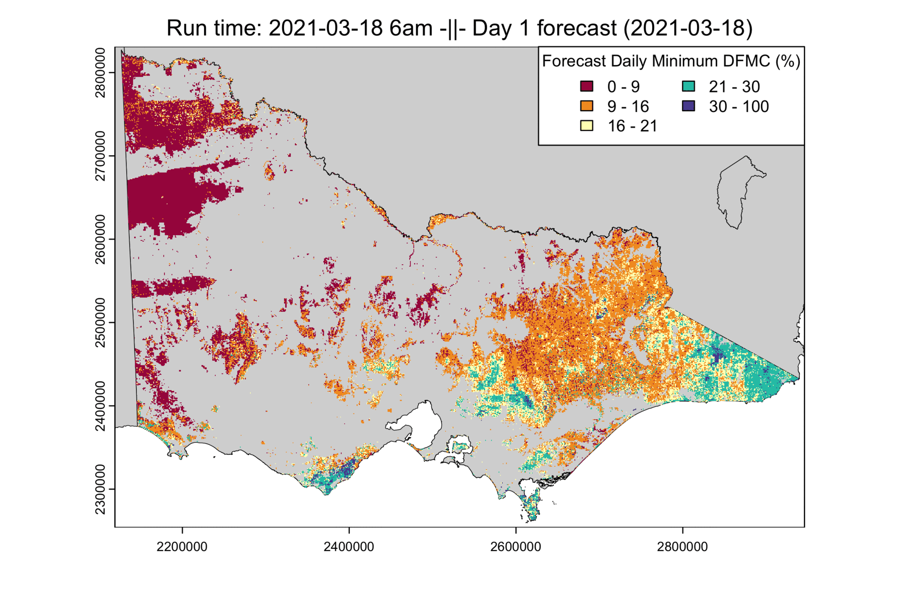

# Untethered from earthly constraints: A spatial seven-day ahead machine-learning forest fuel moisture forecasting system, independent of real-time sensor networks

A repository which holds the shareable scripts associated with the maunscript "Untethered from earthly constraints: A spatial seven-day ahead machine-learning forest fuel moisture forecasting system, independent of real-time sensor networks" by Keeble et al. Note, however, that due to various ownership, copyright and permission barriers, the authors are unable to share the trained models or the input datasets. Despite this, we provide templates for input data structures and a script which details the leave-site-out method utilised so as to adhere to open research principles as best we can amidst the outlined limitations.

## Abstract

Dead fuel moisture content (DFMC) critically influences wildfire behaviour, and its modelling underpins many fire management decision support systems. Recent modelling advances have enabled accurate forecast of point-scale fuel moisture, but their reliance on continuous real-time sensor functionality creates operational vulnerabilities when sensors may fail. Maintaining sensor networks across large, remote domains is costly and unreliable. Therefore, we developed a spatially continuous DFMC forecast system that eliminates real-time sensor dependency by replacing sensor initialisation with remotely sensed and modelled proxies for landscape fuel moisture states. Using 23,354 site-day observations from 27 forested sites in Victoria, Australia, our machine learning model produces 7-day ahead sub-canopy DFMC forecasts with median RMSE of 11.5% and 12.8% for day 1 and 7. The approach delivers reliable spatial forecasts across forested landscapes without sensor-dependent vulnerabilities, representing a significant advancement in operational fire risk management by providing comprehensive coverage for wildfire suppression planning and prescribed burning.


## Usage

For replication of the development environment, a .yml file detailing the conda environment is provided (`cons/spatial_model_env.yml`). To replicate the environment, you can use:

``` 
# Re-create the environment
conda env create --file cons/spatial_model_env.yml
```

Inside the `Model_data/` folder a `model_state.txt` file can be found which details the input variables used in the model. The structuring of such variables in terms of their prior- and future- (forecast) day utilisation and aggregation are detailed in the .csv files found within `Model_data/Model_input_data_structures/`.

The `LSO_analysis.py` script contains the method utilised to conduct the leave-site-out cross validation analysis. However, without both predictor and predictand data, as well as the trained models (both subject to data sharing limitations), this script is not usable, but is provided as demonstration of the approach.


## Bonus application example


## Authors and attribution
Thomas Keeble, Chris Lyell, Gary Sheridan (Forest Hydrology Research Group, The University of Melbourne, Parkville, VIC 3010, Australia)
Tim Gazzard (Department of Environment, Energy, and Climate Action)
Thomas Duff (Country Fire Authority)